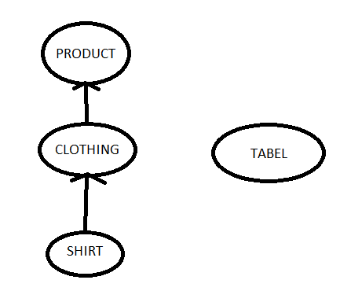
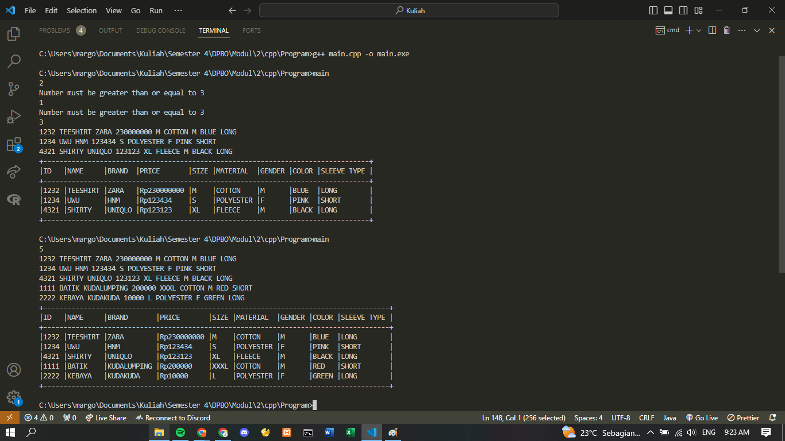

## Janji
*Saya Arya Aydin Margono NIM 2203484 mengerjakan
Latihan Praktikum 1 dalam mata kuliah DPBO
untuk keberkahanNya maka saya tidak melakukan kecurangan seperti yang telah dispesifikasikan. Aamiin.*

## Desain

Terdiri dari 4 class, di mana class Shirt adalah inheritance dari class Clothing, class Clothing adalah inheritance dari class Product, dan class Tabel yang berdiri sendiri.

Class Product terdiri dari atribut-atribut berikut:
1. idProduct
2. name
3. brand
4. price
   
Class Clothing terdiri dari atribut-atribut berikut:
1. size
2. material
3. gender
   
Class Shirt terdiri dari atribut-atribut berikut:
1. color
2. sleeveType

Class Tabel terdiri dari atribut berikut:
1. width

## Alur Program
1. User diminta untuk menginput 1 buah angka yang lebih besar dari 3. Jika user menginput angka yang <= 3, maka program akan mengeluarkan pesan "Number must be greater than or equal to 3" dan akan terus meminta input yang lebih besar dari 3
2. Setelah memasukkan angka, maka user diminta menginput atribut-atribut dengan urutan idProduct -> name -> brand -> price -> size -> material -> gender -> color -> sleeveType
3. Program akan mengeluarkan output berupa tabel berisi data-data sebanyak yang diinput oleh user

## Dokumentasi

### Java

### C++

